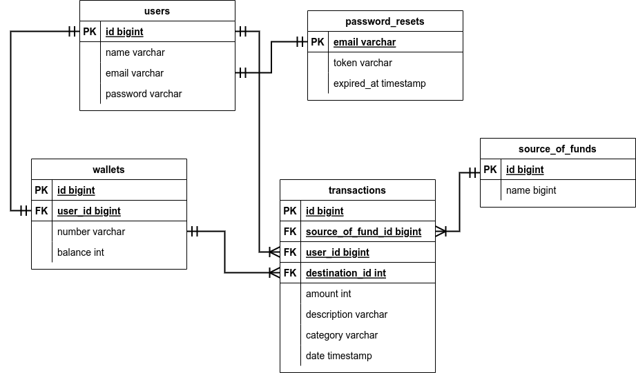

# Wallet Manager: Streamlined Digital Fund Transfers  

## Description
Wallet Manager is a robust and efficient application designed to simplify and secure digital fund transfers between user wallets. With an intuitive interface and powerful backend, Wallet Manager ensures seamless transactions and comprehensive management of user wallets.
 
## Prerequisites      
- Docker  
- Docker Compose 
- PostgreSQL client 

## Getting Started
 
### Step 1: Clone the Repository
Clone this repository to your local machine using:
```
git clone git@github.com:c-kiplimo/Smart-Wallet.git
``` 
Step 2: Set Up Environment Variables
Create a .env file in the project root directory and add the following environment variables:
```
POSTGRES_USER=saadbinnoman
POSTGRES_PASSWORD=yourpassword
POSTGRES_DB=yourdatabase
```
Step 3: Docker Compose Up
Navigate to the project directory and run Docker Compose to set up the PostgreSQL database container:
``` docker-compose up```
Step 4: Create a New User:

Exec into the PostgreSQL container and create a new user:
```docker exec -it your-project-db-container psql -U saadbinnoman -d postgres```
Once inside the PostgreSQL shell, run:
```
CREATE USER newusername WITH PASSWORD 'newpassword';
GRANT ALL PRIVILEGES ON DATABASE postgres TO newusername;
```
Step 5: Perform SQL Data Dump
To load your initial data and create the necessary tables and foreign keys, you need to perform an SQL data dump. Assuming your SQL dump file is named database_dump.sql and located in the root of your project directory, run:
```
docker cp database_dump.sql your-project-db-container:/database_dump.sql
docker exec -it your-project-db-container psql -U saadbinnoman -d postgres -f /database_dump.sql
```
Usage
Checking the Source of Funds Table
To check if the source_of_funds table exists and view its contents:
```
docker exec -it your-project-db-container psql -U saadbinnoman -d postgres

# Inside the PostgreSQL shell
\dt public.source_of_funds
SELECT * FROM public.source_of_funds;

```
Here’s a summary of the entities and their relationships:

Entities:
graph LR          
    - User [Users] --> |deposits into| Wallet [Wallets]                        
    -  User [Users] --> |has many| Transaction [Transactions]                    
    - Wallet [Wallets] --> |involved in| Transaction [Transactions]                    
    - Source of Funds [Source of Funds] --> |has| Types of transsactions [Wallets]                    

ERD DIAGRAM:



API Documentation :
Transfer Endpoint, 
Endpoint for transferring funds.

URL: /deduct

Method: POST

Request Body:
```
{
  "amount": 50000,
  "wallet_number": 100001,
  "description": "Transfer to friend"
}
```
User Registration Endpoint
Endpoint for registering a new user.

URL: /users/sign-up

Method: POST

Request Body:
```
{
  "name": "John Doe",
  "email": "john.doe@example.com",
  "password": "securepassword"
}
```
User Login Endpoint
Endpoint for logging in a user.

URL: /users/sign-in

Method: POST

Request Body:
```
{
  "email": "john.doe@example.com",
  "password": "securepassword"
}
```
Get User Wallets Endpoint
Endpoint for fetching all wallets associated with a user.

URL: /balance

Method: GET

Headers:
```
{
  "Authorization": "Bearer your_jwt_token"
}
```
Add Funds to Wallet Endpoint
Endpoint for adding funds to a user's wallet.

URL: /wallets/topup

Method: POST

Request Body:
```{
  "wallet_number": 100001,
  "amount": 10000,
  "source_of_funds_id": 1
}
and 
{
  "Authorization": "Bearer your_jwt_token"
}
```
Get Wallet Transactions Endpoint
Endpoint for fetching all transactions of a specific wallet.

URL: /wallets/{wallet_number}/transactions

Method: GET

Headers:
```
{
  "Authorization": "Bearer your_jwt_token"
}
```
Tools Used
In this project, several tools are utilized, although you can opt for similar libraries that serve the same purpose. However, be aware that different libraries may have varying implementation methods.


Troubleshooting :
Common Issues
If you encounter any issues with the database connection, ensure that the environment variables in the .env file match your Docker Compose configuration.
Ensure that the database_dump.sql file is correctly formatted and contains all necessary SQL commands to set up your database schema
